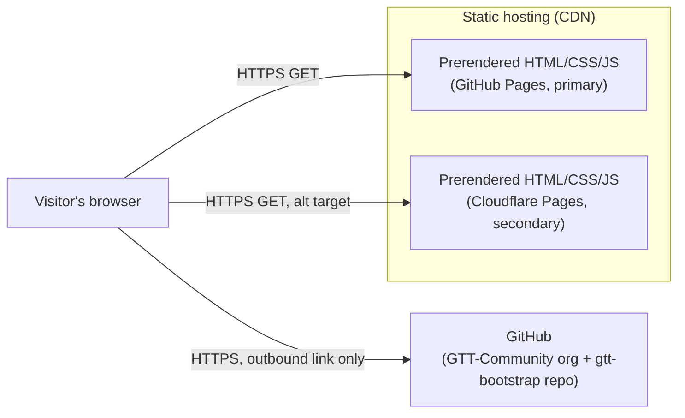
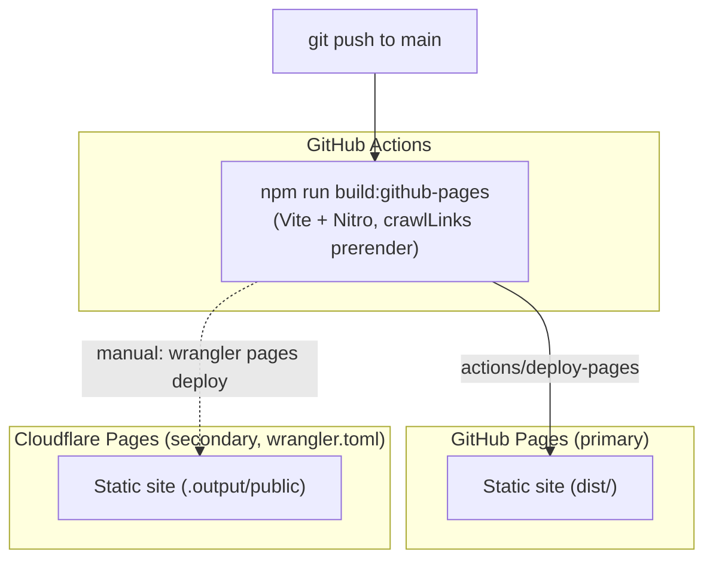

# Stack & Architecture Map

> The single view of this solution. If it is not on this page, it is not part of
> the architecture. Every approved architectural change updates this file in the
> same commit as the ADR that approves it.

- **Last verified:** `2026-09-21` — run the `cdad-audit` skill to refresh
- **Governing ADRs:** ADR-001

---

## 1. Stack at a glance

| Layer | Technology | Version | Locked by |
|---|---|---|---|
| Language | TypeScript | ^5.8.3 | ADR-001 |
| Runtime (build) | Node.js | 22 (per CI) | ADR-001 |
| Runtime (served) | Static HTML/CSS/JS in the browser — no server runtime in production | — | ADR-001 |
| Application framework | TanStack Start (`@tanstack/react-start`) + TanStack Router (file-based routing) on React 19 | react-start 1.168.32, router 1.170.18, react 19.2.0 | ADR-001 |
| Build/bundler | Vite (via `@lovable.dev/vite-tanstack-config`) + Nitro | vite 8.1.5 | ADR-001 |
| Styling | Tailwind CSS v4 + shadcn/Radix UI primitives | tailwindcss ^4.2.1 | ADR-001 |
| Compute model | Static prerendering (`prerender.enabled: true`) — every route built to static output, no server compute at request time | — | ADR-001 |
| Datastore (primary) | None — content is a TypeScript data file (`src/lib/gttContent.ts`), not a database | — | ADR-001 |
| Datastore (cache) | None | — | — |
| Messaging / events | None | — | — |
| Identity & authz | None — public content site, no accounts | — | — |
| Secrets | None required for build or runtime | — | — |
| IaC | None — infrastructure is the GitHub Pages / Cloudflare Pages platform config (`wrangler.toml`), not provisioned via IaC tooling | — | ADR-001 |
| CI/CD | GitHub Actions (`.github/workflows/`) → GitHub Pages, on push to `main` | actions/deploy-pages@v4 | ADR-001 |
| Observability | Browser `console.error` + a Lovable error-reporting hook (`src/lib/lovable-error-reporting.ts`) on route error boundaries. No metrics/traces/alerting pipeline. | — | ADR-001 |
| Testing | None configured — no test runner, no test script in `package.json` | — | — |

"Locked by" points at the ADR that made the decision. A row with no ADR is a
decision nobody made on purpose — treat it as technical debt.

---

## 2. Component map



There is no application server, API gateway, or datastore in this solution —
every route is built to static assets ahead of time.

---

## 3. Deployment topology



---

## 4. Observability

| Signal | Emitted by | Collected via | Stored in | Retention |
|---|---|---|---|---|
| Logs | `console.error` in route `ErrorComponent` | Browser devtools only | Not persisted | N/A |
| Metrics | None | — | — | — |
| Traces | None | — | — | — |
| Audit events | None (no auth, no mutating operations) | — | — | — |

**What is alerted on, and who receives it:**

| Condition | Threshold | Routed to |
|---|---|---|
| (none configured) | | |

---

## 5. Dependency rules

| Module | May depend on | Must not depend on |
|---|---|---|
| `src/routes/*` | `src/contexts/*`, `src/lib/*`, `src/components/*` | Each other's route-local component trees |
| `src/contexts/LanguageContext.tsx` | Nothing app-specific | `src/lib/gttContent.ts` (page copy must not live in the language context) |
| `src/lib/gttContent.ts` | Nothing app-specific (pure data) | React, routing, presentation |
| `src/components/ui/*` | Radix/shadcn primitives | `src/lib/gttContent.ts`, route modules |

---

## 6. Map change log

| Date | ADR | What changed in this map |
|---|---|---|
| 2026-09-21 | ADR-001 | Initial stack map recorded at bootstrap, reflecting the codebase as built (TanStack Start static site, no backend). |

---

## 7. Drift signals

```cdad-drift-signals
package.json  ->  stack table row "Application framework" / "Build/bundler" versions
vite.config.ts  ->  architecture.md "Deployment topology" (github-pages vs cloudflare target switch)
src/lib/gttContent.ts  ->  architecture.md "Data model ownership" (page/slug list)
.github/workflows/  ->  stack table row "CI/CD"
```

---
Governance: L0. Read-only for AI agents. Changes require an approved ADR and are
applied by the Solution Designer.
